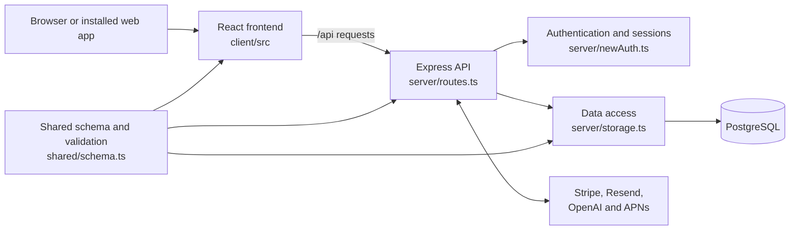

# Swim Squad

Swim Squad is a full-stack swimming-club management application for coaches and club administrators. It brings session planning, calendars, attendance, squad administration, coach management, competitions, scheduling, reporting, billing, and club operations into one system.

The application is written primarily in TypeScript:

- **Frontend:** React and Vite
- **Backend:** Node.js and Express
- **Database:** PostgreSQL accessed through Drizzle ORM
- **Shared contracts:** TypeScript types, database definitions, and Zod validation
- **Hosting and workflows:** Replit

## What the application does

### Sessions and calendars

- View club activity in month, day, list, and table formats
- Create, edit, duplicate, search, and review swimming sessions
- Associate sessions with squads, coaches, locations, and swimmers
- Build sessions from reusable templates and drills
- Estimate the swimming time represented by written session content
- Plan future training blocks through the Season Planner

### Attendance and swimmers

- Record swimmer attendance for sessions
- Manage swimmers and their squad membership
- View swimmer profiles and related information
- Analyse attendance patterns and trends

### Coaches and club administration

- Manage coaches, squads, locations, rates, and club settings
- Invite and register users through controlled account flows
- Apply club-specific branding
- Manage coaching invoices and activity summaries
- Maintain a club handbook and operational information

### Scheduling and cover

- Define recurring schedules
- Generate sessions from schedule information
- Record coach availability and absence
- Manage cover and float-coach requirements
- Support session-related notifications and Apple push notifications

### Competitions and feedback

- Create and manage competitions
- Assign competition coaching responsibilities
- Collect session feedback
- Review feedback analytics

### AI-assisted coaching tools

- Parse written swimming sets into structured information
- Estimate distances and timings from coaching notation
- Provide an AI coaching assistant and session-writing support

### Billing and communications

- Manage club subscriptions through Stripe
- Open Stripe’s customer billing portal
- Send invitation and password-related email through Resend
- Process Stripe webhooks and subscription updates

## Architecture at a glance



The frontend and backend are part of the same application:

1. React renders the screens in the browser.
2. Frontend pages call relative `/api/...` endpoints.
3. Express authenticates and validates the request.
4. Route handlers call the storage layer.
5. Drizzle reads or writes PostgreSQL.
6. JSON responses return to the frontend, where TanStack Query refreshes the relevant screen data.

## Repository guide

### `client/` — frontend application

Everything displayed and interacted with in the browser starts here.

| Path | Purpose |
|---|---|
| `client/index.html` | HTML document loaded by Vite. It provides the root element into which React is mounted. |
| `client/public/` | Static browser assets such as favicons, application icons, and the web-app manifest. |
| `client/src/main.tsx` | Frontend entry point. It mounts the React application and global providers. |
| `client/src/App.tsx` | Main application shell and top-level navigation. It coordinates authentication-aware views and many major feature areas. |
| `client/src/pages/` | Feature screens, including calendars, sessions, swimmers, coaches, competitions, invoices, billing, scheduling, cover, and season planning. |
| `client/src/components/` | Reusable application components such as dialogs, sidebars, search, feedback, swimmer profiles, and session-writing tools. |
| `client/src/components/ui/` | Low-level reusable UI controls such as buttons, forms, dialogs, tables, menus, and inputs. |
| `client/src/hooks/` | Reusable React behavior and state hooks. |
| `client/src/lib/queryClient.ts` | Shared frontend HTTP and TanStack Query configuration. This is an important starting point when investigating how the browser calls the API. |
| `client/src/lib/` | Other frontend helpers, formatting utilities, and domain-specific calculations. |
| `client/src/index.css` | Global styling, Tailwind layers, theme variables, and shared visual rules. |

When requesting a visual or interaction change, it is helpful to name the relevant file in `client/src/pages/` or `client/src/components/`.

### `server/` — backend application

The server authenticates users, exposes the API, applies business rules, communicates with external services, and reads or writes the database.

| Path | Purpose |
|---|---|
| `server/index.ts` | Backend process entry point. It configures Express, startup behavior, webhooks, API routes, frontend serving, and the listening port. |
| `server/routes.ts` | Main REST API route registry. Start here when investigating what happens after the frontend calls an `/api/...` endpoint. |
| `server/storage.ts` | Main data-access layer. It contains the Drizzle queries used to create, read, update, and deactivate application records. |
| `server/db.ts` | Creates the PostgreSQL connection and typed Drizzle database client. |
| `server/newAuth.ts` | Email/password authentication, invitations, sessions, authorization middleware, and account-related flows. |
| `server/emailService.ts` | Email delivery through Resend. |
| `server/stripeClient.ts` | Stripe client configuration and shared Stripe access. |
| `server/webhookHandlers.ts` | Processing for Stripe webhook events. |
| `server/aiParser.ts` | AI-assisted parsing of written swimming sessions. |
| `server/aiAssistant.ts` | AI coaching-assistant behavior. |
| `server/seasonPlanner.ts` | Season-planning domain logic. |
| `server/privacyRoutes.ts` | Privacy-related HTTP routes and document delivery. |
| `server/notifications/` | Notification scheduling, session checks, and Apple Push Notification service integration. |
| `server/*.test.ts` | Focused backend tests for selected domain behavior. |
| `server/vite.ts` | Development Vite integration and production static-file serving support. |

For a backend change, prompts are more precise when they identify the API route in `server/routes.ts` and, where data is involved, the related storage operation in `server/storage.ts`.

### `shared/` — frontend/backend contracts

Code in this folder can be imported by both sides of the application.

| Path | Purpose |
|---|---|
| `shared/schema.ts` | Central database and data contract. It defines PostgreSQL tables, Drizzle relations, TypeScript record types, and many Zod validation schemas. |
| `shared/` supporting files | Shared constants or helpers used across the browser and server. |

If a feature requires a new stored field or database entity, `shared/schema.ts` is normally one of the first files to inspect.

### `migrations/` — database history

This folder contains ordered SQL changes and Drizzle migration metadata.

- `migrations/*.sql` contains tracked database changes.
- `migrations/meta/` contains Drizzle snapshots and its migration journal.

These files are part of the database’s history. They should not be casually edited, regenerated, reordered, or deleted. Schema changes should keep `shared/schema.ts`, the migration files, and the state of each deployed database aligned.

### `scripts/` — administrative utilities

This folder contains manually run or lifecycle-related utilities, including development migration handling and data or integration maintenance. Scripts can change external services or database state, so their purpose and target environment should be checked before they are run.

### Root configuration files

| Path | Purpose |
|---|---|
| `package.json` | JavaScript dependencies and the main development, build, start, type-check, and database commands. |
| `package-lock.json` | Exact resolved npm dependency versions. It is generated by npm but should remain tracked for reproducible installs. |
| `tsconfig.json` | TypeScript compiler configuration and import aliases. |
| `vite.config.ts` | Frontend build and development-server configuration. |
| `drizzle.config.ts` | Drizzle schema, migration, and PostgreSQL configuration. |
| `tailwind.config.ts` | Tailwind CSS design and content-scanning configuration. |
| `postcss.config.js` | CSS processing configuration. |
| `components.json` | Shared UI component configuration. |
| `.replit` | Replit runtime, workflow, deployment, module, and port configuration. |
| `.gitignore` | Files and generated folders Git should not track. |
| `replit.md` | Project-specific guidance for agents and maintainers working in Replit. |

## Other repository material

### `attached_assets/`

This is primarily an upload and reference area. It contains historical source snapshots, screenshots, requirements documents, design references, media, pasted evidence, and other files used during earlier development work.

Most files here are **not the active application source**. The maintained application should normally be changed under `client/`, `server/`, `shared/`, `migrations/`, or `scripts/` instead of editing timestamped copies in `attached_assets/`.

However, the folder must not be treated as entirely disconnected from the application:

- `attached_assets/Swim_Squad_1771264189149.png` is currently referenced by `client/src/components/LoadingScreen.tsx`.
- Some files may still have historical, design, audit, legal, manual, or externally linked value even when no source-code reference exists.
- Sensitive-looking files require security review rather than casual inspection or deletion.

For these reasons, the assets are retained as reference material unless they have been individually reviewed. They generally do not define application behavior, but that statement is not a guarantee that every file can be removed or moved safely.

### Documentation and reviews

| Path | Purpose |
|---|---|
| `REPOSITORY_REVIEW.md` | Detailed technical inventory and explanation of every tracked repository path. |
| `REPOSITORY_PROFESSIONALISATION_REVIEW.md` | Read-only assessment of repository structure, navigation, uploaded assets, and possible future professionalisation. |
| `design_guidelines.md` | Product design and interface guidance. |
| `AI_PARSING_IMPLEMENTATION_PLAN.md` | Historical planning and technical notes for AI session parsing. |
| `COACH_TRAINING_SESSION_PARSER.md` | Coach-facing notation and parser guidance. |
| `session_analysis.md` | Analysis material relating to session parsing and estimates. |
| `privacy_documents/` | Privacy and legal text used by the project. |
| `reports/` | Generated or exported audit information rather than runtime source code. |

### Replit and agent metadata

- `.agents/` contains project memory and agent-related metadata.
- `.local/` contains Replit-local skills, task plans, and workspace support data.

These areas support work on the project but are not imported as application runtime source.

## Common starting points

| If you want to understand or change… | Start with… |
|---|---|
| Main navigation or which screen appears | `client/src/App.tsx` |
| A specific screen | `client/src/pages/` |
| A reusable dialog, panel, or editor | `client/src/components/` |
| Shared buttons, forms, menus, or inputs | `client/src/components/ui/` |
| Global colours, spacing, or typography | `client/src/index.css`, `tailwind.config.ts` |
| Frontend API requests and caching | `client/src/lib/queryClient.ts` |
| An API endpoint | `server/routes.ts` |
| Authentication or permissions | `server/newAuth.ts` |
| Database reads and writes | `server/storage.ts` |
| Database tables and stored fields | `shared/schema.ts` |
| Database change history | `migrations/` |
| Stripe subscriptions and webhooks | `server/stripeClient.ts`, `server/webhookHandlers.ts`, `server/routes.ts` |
| Email delivery | `server/emailService.ts` |
| AI parsing or coaching assistance | `server/aiParser.ts`, `server/aiAssistant.ts` |
| Push notifications | `server/notifications/` |
| Build or runtime commands | `package.json`, `.replit`, `vite.config.ts` |

## Development commands

```bash
# Start the development application
npm run dev

# Type-check the TypeScript project
npm run check

# Build the frontend and backend for production
npm run build

# Run the production build
npm run start
```

`npm run db:push` applies schema state to a configured database and should only be used with a clear understanding of the target environment and migration history.

## Environment and integrations

The application requires configured environment variables or Replit integrations for services such as:

- PostgreSQL
- Session security
- Stripe
- Resend
- OpenAI/Replit AI
- Apple Push Notification service

Credentials and private keys must be stored in Replit Secrets or an equivalent secret manager. They must never be committed to Git or documented in this README.

## Further reading

For a complete file-by-file catalogue and deeper operational notes, read:

1. [`REPOSITORY_REVIEW.md`](REPOSITORY_REVIEW.md)
2. [`REPOSITORY_PROFESSIONALISATION_REVIEW.md`](REPOSITORY_PROFESSIONALISATION_REVIEW.md)
