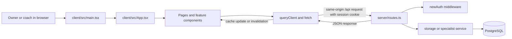
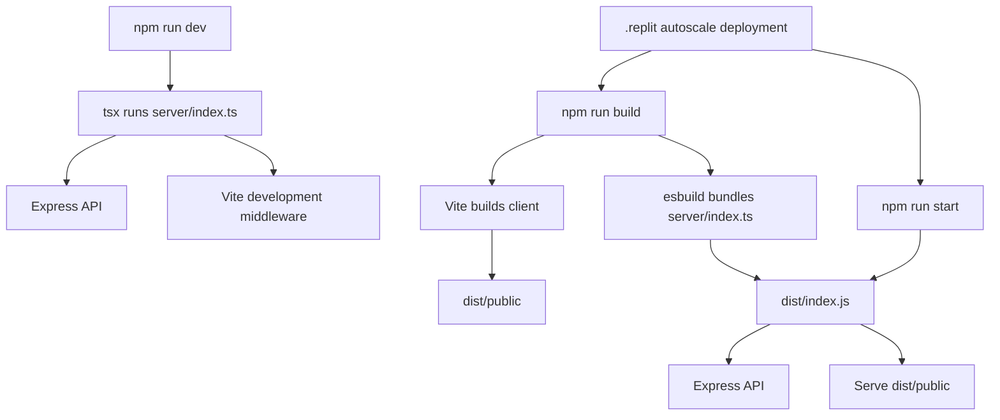
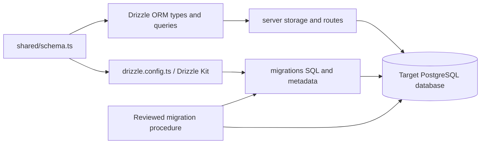
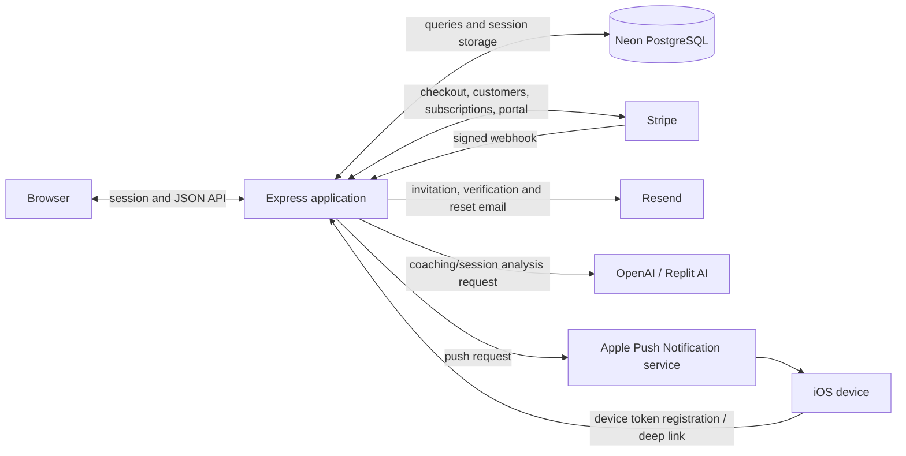

# Safe Repository Professionalisation Review

**Audience:** repository owner.  
**Review mode:** read-only analysis of the tracked repository.  
**Application impact:** none intended. This document is the only deliverable. No existing file was deleted, moved, renamed, edited, archived, or otherwise cleaned up.

## 1. What this review is for

This review explains where the main parts of the application live, how they connect, and how to describe future work precisely. It also reassesses the uploaded material catalogued as Appendix C in `REPOSITORY_REVIEW.md`.

The most important conclusion is:

> `attached_assets` is not wholly unused. `attached_assets/Swim_Squad_1771264189149.png` is imported by `client/src/components/LoadingScreen.tsx` and is therefore a proven runtime build input.

The remainder of `attached_assets` includes source-like snapshots, requirements documents, screenshots, pasted text, media, and a sensitive-looking Apple key export. Static searches can show that a tracked source file refers to an asset. They cannot prove that an apparently unreferenced asset has no manual, legal, audit, historical, deployment, agent-context, or external use.

This review makes recommendations only. “Move it to an archive” is still a repository change: it changes a path and can break source imports, documentation links, scripts, deployment inputs, or external procedures. It is not automatically zero-impact.

## 2. Repository map

The current tracked inventory contains 646 paths. The major groups are 441 paths in `attached_assets`, 122 in `client`, 22 in `server`, 22 in `migrations`, 19 at the root, 6 in `scripts`, 6 in `.agents`, 4 in `shared`, 2 in `reports`, and 2 in `privacy_documents`.

| Area | What it contains | Runtime role | Owner guidance and lifecycle |
|---|---|---|---|
| `client/` | React screens, feature components, UI primitives, hooks, browser helpers, CSS, HTML shell, public icons | Browser application; built by Vite | This is the first place to look for visible screens, navigation, forms, styling, and browser API calls. Maintain as active product source. |
| `client/src/pages/` | Calendar, session, admin, billing, scheduling, availability, season-planning and other screens | Feature-level frontend | Point future requests at the relevant page when the change is visible on one screen. |
| `client/src/components/` | Reusable and feature-specific components | Shared frontend composition | Use for loading, navigation, search, modals, profile views, editors and reusable feature panels. |
| `client/src/components/ui/` | Reusable Radix/Tailwind UI primitives | Shared visual building blocks | Change carefully because one primitive can affect many screens. |
| `client/src/App.tsx` | Main application shell, routes/views, navigation and cross-feature composition | Frontend entry after `main.tsx` | Look here for application-wide navigation, authentication gating and view selection. |
| `client/src/lib/queryClient.ts` | Credentialed `fetch` wrapper and TanStack Query defaults | Browser/server boundary | Look here for shared request and cache behavior; feature-specific endpoints remain in pages/components. |
| `client/src/index.css` | Tailwind layers, colour variables, global layout and utility rules | Global frontend styling | Use for app-wide design tokens and viewport behavior, not isolated screen styling unless it is intentionally global. |
| `server/` | Express startup, API routes, authentication, storage, billing, email, AI, privacy and notification services | Node.js backend | Active runtime source. Start with `routes.ts` for an endpoint, then follow it to storage or a service. |
| `server/index.ts` | Middleware order, Stripe webhook, startup work, route registration, Vite/static serving and port binding | Backend process entry | Look here for startup, middleware, serving and deployment-runtime questions. Startup includes database and Stripe work, so edits require particular care. |
| `server/routes.ts` | REST endpoints, validation, authorization and orchestration | API boundary | Look here to find what the browser can request and which role checks apply. |
| `server/newAuth.ts` | Email/password auth, sessions and authorization middleware | Authentication boundary | Look here for login, invitations, verification, password reset, cookies and role access. |
| `server/storage.ts` | Storage interface and Drizzle-backed database operations | Data-access layer | Look here for reads/writes and club scoping after locating an API route. |
| `server/db.ts` | Neon/PostgreSQL connection and Drizzle client | Database connection | Look here for connection behavior, not table design. |
| `shared/` | Database schema, shared types and shared parsing logic | Contract shared by browser and server | `shared/schema.ts` is the central source for tables, relations, inferred types and validation schemas. |
| `migrations/` | SQL migrations and Drizzle metadata/journal | Ordered database history | Preserve. Never treat old migrations as disposable duplicates; deployed databases may depend on their exact history. |
| `scripts/` | Operational and maintenance scripts, including post-merge setup | Manual/automation support | Read a script and its caller before running or changing it. Scripts can alter schemas or data even when not imported by runtime code. |
| `reports/` | Generated/exported CSV material | Evidence/output, not application source | Confirm audit and retention needs and the generating process before replacement or removal. |
| `privacy_documents/` | Privacy/legal text served or maintained with the application | Legal/product material | Treat as controlled content. Confirm publication and retention obligations before changing it. |
| `attached_assets/` | Uploaded code snapshots, requirements, screenshots, media, pasted text and one proven runtime image | Mixed: one proven runtime asset; much reference/history; some unresolved | Do not apply one cleanup rule to the whole directory. Use the evidence classes in section 8. |
| `.agents/` | Agent metadata and durable project context | Tool/collaboration metadata | Not normal application source, but may be used by Replit agents and collaborators. |
| `.replit` | Runtime modules, workflows, deployment commands, ports and integration metadata | Replit build/run/deploy configuration | Active operational configuration. |
| Root configuration | `package.json`, lockfile, Vite, TypeScript, Tailwind, PostCSS and Drizzle config | Build, dependency and tooling contracts | Active configuration. Dependency or command changes can alter both development and deployment. |
| Root Markdown/SQL/test files | Plans, domain notes, design guidance, analysis, manual SQL and parser test material | Documentation or operator/developer support | Establish the owning workflow before reorganising. A file need not be imported to remain useful. |
| Ignored/local areas | `node_modules`, `dist`, caches and local screenshots may exist without being tracked | Generated/local state | Not part of the tracked review scope. Their presence does not make them source or a cleanup target for this task. |

## 3. Main system boundaries

### Frontend/backend boundary



Text version:

```text
Browser
  -> main.tsx
  -> App.tsx
  -> page/component
  -> credentialed fetch to /api/...
  -> Express route
  -> authentication/authorization and validation
  -> storage or integration service
  -> JSON response
  -> TanStack Query cache
  -> updated screen
```

The browser and API share one origin. `queryClient.ts` includes credentials, bypasses the browser HTTP cache for queries, and leaves application data caching to TanStack Query. Its default stale time is infinite and automatic retries are disabled, so mutations must deliberately invalidate or update relevant queries.

### Browser-to-database request flow

```mermaid
sequenceDiagram
    participant B as Browser component
    participant E as Express route
    participant A as Auth/validation
    participant S as storage.ts
    participant DB as Drizzle/Neon/PostgreSQL
    B->>E: HTTP request to /api/... + session cookie
    E->>A: Identify user, role and club; validate input
    A-->>E: Allowed request or error
    E->>S: Club-scoped operation
    S->>DB: Typed SQL query
    DB-->>S: Rows/result
    S-->>E: Domain record
    E-->>B: JSON + HTTP status
    B->>B: Update/invalidate query cache and render
```

`server/routes.ts` is the public application API boundary. `server/storage.ts` is the main data-access boundary. `server/db.ts` creates the database client, while `shared/schema.ts` defines the typed table contract used by storage and shared frontend types. Authentication and club ownership checks must happen before an identifier reaches an unrestricted data operation.

### Build and runtime flow



Text version:

```text
Development: npm run dev
  -> tsx executes server/index.ts
  -> Express registers API routes
  -> Vite serves/transforms the React client

Production build: npm run build
  -> Vite writes browser assets to dist/public
  -> esbuild writes the server bundle to dist/index.js

Production run: npm run start
  -> Node runs dist/index.js
  -> Express serves both /api and the built browser files
```

Vite resolves `@` to `client/src`, `@shared` to `shared`, and `@assets` to `attached_assets`. This last alias is why an item in Appendix C can be a production build input. Vite’s output directory is emptied during a build, but that affects generated `dist`, not tracked source assets.

### Database schema and migration flow



Text version:

```text
shared/schema.ts describes intended tables and types
  -> storage uses that contract for runtime queries
  -> Drizzle Kit uses it as schema input
  -> migrations preserve ordered database changes
  -> a controlled operator/deployment process applies changes to each database
```

Schema definitions, migration files, migration metadata and actual database state are related but not interchangeable. A schema edit does not itself prove that every environment was migrated. Existing migration history must be preserved, and any discrepancy between SQL files and the migration journal requires a reviewed, environment-specific reconciliation rather than regeneration or deletion.

## 4. External service connections



| Service | Where to begin | Purpose | Change caution |
|---|---|---|---|
| PostgreSQL/Neon | `server/db.ts`, `server/storage.ts`, `shared/schema.ts`, `migrations/` | Durable application and session data | Back up and use reviewed migrations; protect club boundaries. |
| Stripe | `server/index.ts`, `server/stripeClient.ts`, `server/webhookHandlers.ts`, billing/registration routes and pages | Registration, subscription state, quantities, portal and webhooks | Webhook raw-body ordering and signature verification are critical. Development and production use different key selection. |
| Resend | `server/emailService.ts`, auth/invitation routes | Invitations, verification and password-reset delivery | Avoid exposing tokens or personal data in logs; handle delivery failure separately from database success. |
| OpenAI/Replit AI | `server/aiParser.ts`, `server/aiAssistant.ts`, related frontend helpers | Session parsing and coaching assistance | Validate model output and preserve explicit failure behavior. |
| APNs | `server/notifications/`, device-token routes, native bridge in the client | iOS reminders and deep links | Treat signing material and device tokens as sensitive. Scheduler and delivery behavior are operational concerns. |
| Replit | `.replit`, package scripts, `server/vite.ts` | Development workflow, autoscale build/run and preview | Configuration changes can affect preview and production even without application-source edits. |

## 5. Where to look and how to prompt

An owner does not need to know the implementation. A useful request names the visible outcome, affected users, and the likely area. Paths provide precision without prescribing the solution.

| Future request | Point to | Example prompt |
|---|---|---|
| Change one screen | Relevant file in `client/src/pages/` and any feature component it imports | “On the Availability & Cover screen in `client/src/pages/availability-cover.tsx`, make the coach’s own requests easier to distinguish on mobile. Keep the desktop behavior unchanged.” |
| Change navigation or an app-wide view | `client/src/App.tsx`, sidebar/home components | “Add an admin navigation entry for the existing report. Start from `client/src/App.tsx` and `client/src/components/CollapsibleSidebar.tsx`; do not change coach permissions.” |
| Change shared buttons/dialogs/forms | `client/src/components/ui/` plus the consuming screens | “Make destructive confirmation dialogs consistent. Check the shared dialog primitives and list every consuming screen before changing them.” |
| Change global colours or layout | `client/src/index.css`, Tailwind config, app shell | “Adjust the global focus style in `client/src/index.css`. Preserve club colour variables and check light and dark modes.” |
| Add or change an API operation | Calling page/component, `server/routes.ts`, `server/storage.ts`, `shared/schema.ts` if data shape changes | “Allow admins to update X. Trace the frontend call through `server/routes.ts` to `server/storage.ts`, validate input, enforce club ownership, and update shared types only if required.” |
| Change login or permissions | `server/newAuth.ts`, auth hooks/pages, affected routes | “Require admin access for X without changing normal coach login. Review `server/newAuth.ts` and every affected route.” |
| Change database structure | `shared/schema.ts`, `migrations/`, storage, relevant tests | “Add X to Y. Propose an additive PostgreSQL migration, preserve existing rows, and explain the development/production migration sequence before applying anything.” |
| Change billing | Billing/registration frontend, `server/stripeClient.ts`, `server/webhookHandlers.ts`, Stripe routes in `server/routes.ts`, webhook setup in `server/index.ts` | “Change how active coaches affect subscription quantity. Cover both direct app actions and Stripe webhook reconciliation; do not weaken signature verification.” |
| Change email | `server/emailService.ts`, route/auth caller | “Update the invitation email wording but not token lifetime or invitation state. Show which route calls the template.” |
| Change AI parsing/assistant behavior | `server/aiParser.ts`, `server/aiAssistant.ts`, `shared/sessionParser.ts`, related tests and product notes | “Improve parsing of grouped repeats. Preserve deterministic parsing where available and add examples for ambiguous input.” |
| Change push notifications | `server/notifications/`, device-token API, native bridge | “Adjust reminder timing without displaying signing keys or device tokens. Explain scheduler, deduplication log and APNs failure behavior.” |
| Add a test | Nearby `*.test.ts`, package/TypeScript test setup | “Add a regression test proving another club cannot access X. Keep it independent of live services and explain how to run it.” |
| Change deployment behavior | `.replit`, `package.json`, `server/index.ts`, `server/vite.ts`, Vite config | “Explain the current development/build/start flow, then make the smallest Replit configuration change. Do not change database startup behavior.” |
| Review uploaded material | `attached_assets/`, Appendix C, Vite aliases and repository-wide reference search | “Classify these named assets. Do not move or delete them. Search exact filenames, aliases, config, scripts and docs; list unresolved manual/external uses.” |
| Change privacy/legal text | `privacy_documents/`, `server/privacyRoutes.ts`, linked frontend/public routes | “Update the named policy text only after showing where it is served and whether an app-store or public URL depends on it.” |

For risky work, add: “Before editing, show the request path, affected data, authorization boundary, migration/deployment effect, and rollback approach.”

## 6. Appendix C audit method and limits

The audit used the tracked Git inventory as its scope and searched tracked source, configuration, styles, HTML, manifests, scripts and documentation for:

1. directory references to `attached_assets`;
2. alias references to `@assets`;
3. exact references to the proven logo filename;
4. sensitive-looking filenames; and
5. extension and filename patterns that help classify, but do not prove, likely purpose.

Observed build behavior matters:

* `vite.config.ts` maps `@assets` to the repository’s `attached_assets` directory.
* `client/src/components/LoadingScreen.tsx` imports `@assets/Swim_Squad_1771264189149.png`.
* The imported image is rendered as the loading-screen logo.
* Therefore this image must remain at the expected path unless source and build behavior are deliberately changed and verified together.
* No other tracked source/config reference to the directory or an individual Appendix C filename was found by the performed static searches.

The last point is evidence of **no discovered tracked static reference**, not proof of no use. Static search can miss:

* dynamically constructed filenames or paths;
* untracked scripts, local operator notes or deployment history;
* manual use as design, product, training or support reference;
* legal, privacy, audit, incident or app-store evidence;
* Replit agent context or earlier conversation attachments;
* files linked from email, tickets, documents, published pages or external systems;
* material expected by a person rather than imported by code;
* duplicate-looking files where each copy records a different source or date.

The audit did not open, reproduce or expose the contents of the sensitive-looking `.p8` file.

## 7. Evidence and decision principles

Use these rules before any future cleanup:

1. **Positive reference evidence outranks appearance.** A source import proves runtime relevance even if the file sits in a reference-looking folder.
2. **Absence of a tracked static reference is limited evidence.** It lowers confidence of application runtime use but says little about external/manual use or retention obligations.
3. **A filename is not provenance.** Timestamps and suffixes suggest historical uploads but do not establish who supplied a file, why, or whether it is authoritative.
4. **Sensitivity changes the process.** A key-like filename requires controlled security review, not ordinary browsing, copying or archiving.
5. **Reversibility is not the same as safety.** Git can restore a deleted tracked file, but that does not prevent a broken deployment, exposed secret, lost external link or missing audit record.
6. **Moves are changes.** Archiving inside the repository changes paths and Git history. References must be updated and validated, and external users may still rely on the old path.
7. **Database and migration history are not cleanup material.** They require separate operational governance.

## 8. Conservative classification of Appendix C

The 441 tracked Appendix C items break down by extension into 290 PNG, 2 JPEG, 91 TSX, 6 TS, 3 CSS, 30 DOCX, 16 TXT, 1 Markdown, 1 Swift and 1 P8 file. Extension totals are descriptive, not deletion decisions.

Some classes overlap conceptually. The decision order should be: runtime reference first, then sensitivity, then provenance/retention, then possible cleanup.

### Class A — proven runtime-referenced: retain in place

| Item | Evidence | Decision |
|---|---|---|
| `attached_assets/Swim_Squad_1771264189149.png` | Imported through `@assets` by `client/src/components/LoadingScreen.tsx`; alias defined in `vite.config.ts`; rendered by the loading screen | Retain at its current path. Do not move, rename or delete without a deliberate code/config change plus development and production-build verification. |

### Class B — sensitive or security-review required: isolate from ordinary cleanup

| Item/group | Evidence | Decision |
|---|---|---|
| `attached_assets/AuthKey_L92UYWKD84_1768660547189.p8` | Filename and extension resemble an Apple authentication private key export. Content was not inspected. | Treat as potentially sensitive. Restrict handling, establish whether it is real/current, and use an approved secret-scanning/security process. If valid or ever valid, assess rotation/revocation and removal from Git history separately. Do not copy it into a normal archive. |
| Any future asset resembling a key, token, certificate, credential export, personal-data extract or database dump | Sensitivity can be indicated by name, extension or provenance even without a source reference | Stop normal classification. Use security/privacy review and avoid exposing content in reports or chat. |

### Class C — likely historical or source snapshots: reference value; not active source by default

| Item/group | Evidence | Conservative interpretation |
|---|---|---|
| 91 `.tsx`, 6 `.ts`, 3 `.css` and 1 `.swift` uploads, including timestamped names such as `App_...tsx`, screen/component names and pasted native code | Timestamped source-like copies live outside active `client`, `server` and `shared` trees; current build aliases the directory for assets but no discovered import points to these source snapshots | Likely uploaded implementation examples, previous versions, handoffs or agent inputs. Compare provenance and content to active source before considering deduplication. They may preserve decisions or rollback context even when not compiled. |

These files should not be presented as alternative current source without comparison. Future professionalisation could index them by feature, upload date and relationship to active code.

### Class D — design and requirements references: preserve until ownership and retention are clear

| Item/group | Evidence | Conservative interpretation |
|---|---|---|
| 30 `.docx` files and `Guidelines_...md`, with names covering scheduling, notifications, billing, handbook, dashboards, competitions and other features | Human-readable requirement/design naming and timestamps | Likely product requirements, review feedback, app-store correspondence or design handoffs. They may be valuable even with no runtime reference. Confirm supersession, legal/audit value and external source before archiving or deleting. |

### Class E — screenshots and media: manual/design/support use possible

| Item/group | Evidence | Conservative interpretation |
|---|---|---|
| PNG/JPEG items other than the proven logo, including `Screenshot_...`, `SS_...`, `IMG_...` and many timestamped images | 292 image/media-extension files in total; filenames often indicate screenshots or camera images | Likely UI evidence, visual references, issue reports, branding, app-store review material or uploaded examples. Image similarity or an absent source import is insufficient proof of duplication or irrelevance. |

The proven loading logo belongs in Class A, not in a bulk “screenshots/media” action.

### Class F — reports, exports and pasted evidence: retention and privacy review

| Item/group | Evidence | Conservative interpretation |
|---|---|---|
| 16 `.txt` items, many beginning `Pasted-`, including command output, requirements, correspondence and sample session text | Names indicate captured text or operator/agent input | Could be debugging evidence, acceptance criteria, correspondence, SQL output or test input. Review for personal data, credentials, legal/audit relevance and whether a maintained document supersedes it. Do not republish contents during classification. |
| Tracked `reports/*.csv` outside Appendix C | Explicit report/export location | Keep separate from uploaded assets. Confirm generation, consumers, personal data and retention policy before cleanup. |

### Class G — uncertain or external-use possible

This is the default for any item that does not have enough evidence for another decision. It includes files with opaque names, duplicates distinguished only by timestamp, and items for which static searches find no tracked reference.

“Uncertain” is not a recommendation to retain forever. It means the next safe action is to collect provenance and ownership, not to delete.

## 9. Ranked recommendations

### Highest confidence and most reversible

1. **Keep the proven loading-screen logo in place.** Record it in any future asset inventory as a runtime build input.
2. **Create an inventory outside runtime paths before moving anything.** For each candidate, record current path, checksum, size, type, likely owner/source, upload date where known, discovered references, sensitivity, retention reason and proposed disposition. Creating such an inventory would be a separate repository change and is not performed here.
3. **Apply clear labels, not deletion claims.** Use statuses such as `runtime`, `security review`, `reference`, `historical candidate`, `retention unknown` and `external-use check pending`.
4. **Separate security handling from housekeeping.** Review the `.p8` candidate through an approved process without opening or reproducing it casually.

### Medium confidence; requires owner/process evidence

5. **Identify authoritative requirements.** Ask the owner which DOCX/Markdown items remain contractual, legal, app-store, product or design records. Mark superseded material only when the authoritative successor is named.
6. **Compare source snapshots to active source by feature and provenance.** Similar text does not establish a safe duplicate. Preserve dates and origin in any index.
7. **Check external/manual use.** Search tickets, app-store submissions, shared links, support procedures, design tools, email and deployment records where the owner has access. Repository search alone cannot perform this check.
8. **Set an agreed retention policy.** Different rules may be needed for legal/privacy documents, security incidents, reports, product requirements, screenshots and temporary uploads.

### Lower confidence and less reversible; hypothetical only

9. **Archive candidates only after prerequisites pass.** An archive may be inside Git, in restricted object storage, or in a controlled records system. The correct location depends on sensitivity and retention needs. An in-repository archive is still a path-changing repository edit.
10. **Delete only after archive/retention decisions.** Deletion should be limited to items proven unnecessary to runtime, deployment, legal/audit records, external links, agent context, design/product history and rollback needs.
11. **Do not rewrite Git history as routine cleanup.** History rewriting affects every clone and reference and requires a separate security/operations plan. It may be appropriate for a confirmed exposed secret, but not as general tidying.

## 10. Prerequisites for any future archive or deletion

Every candidate should pass all applicable checks:

### Prove no application or deployment impact

* Search the exact path and basename across tracked source, configuration, CSS, HTML, manifests, scripts and documentation.
* Search directory aliases and path-construction code, not just literal filenames.
* Check Vite/build configuration, public/static copying, server static serving and deployment commands.
* Check case sensitivity and filenames containing spaces or punctuation.
* Build from a clean checkout and inspect the resulting asset graph.
* Exercise the affected visible flow, including initial loading for the known logo.
* Confirm development and production build/run behavior.

### Retain provenance and rollback

* Record path, checksum, size, type, origin, owner, date and reason for disposition.
* Preserve a reviewable mapping from old path to archive location or deletion approval.
* Use a repository checkpoint/commit and a tested restore procedure.
* Keep an appropriate retention window before irreversible deletion.
* Do not mix sensitive material into a broadly accessible archive.

### Check external and manual use

* Ask product, design, support, legal/privacy and deployment owners.
* Check externally published links, app-store material, tickets, email, design tools and operating procedures.
* Confirm whether agents or collaborators use the file as an instruction/reference input.
* Establish whether a newer file is truly authoritative rather than merely newer.

### Protect sensitive material

* Do not open, paste, log or reproduce key/token contents during inventory.
* Use approved secret scanning and access controls.
* If a credential is confirmed, determine exposure scope and rotate/revoke before relying on repository deletion.
* Consider Git history, forks, caches, deployments and local clones in the response plan.
* Review personal-data and legal retention obligations before relocating reports or correspondence.

## 11. Professionalisation opportunities outside Appendix C

These are observations for later decisions, not work performed:

* Add an owner-approved repository guide that distinguishes maintained source, generated output, operational scripts, legal records and uploaded references.
* Establish one documented migration procedure that reconciles schema definitions, SQL migrations, Drizzle metadata and environment state without generic destructive pushes.
* Document the owner and safe invocation of each script and manual SQL file.
* Define report generation and retention rules separately from source-code rules.
* Add narrow prevention controls for future sensitive uploads only after confirming they will not hide required tracked files.
* Treat large structural moves, dependency changes and startup refactors as application work with their own validation, not as repository tidying.

## 12. Non-impact statement and validation standard

No cleanup was performed. Specifically, this review did not:

* delete, move, rename, consolidate, archive or edit an existing file;
* change application code, configuration, dependencies, workflows, migrations or database state;
* change integrations, secrets, environment variables or `.gitignore`;
* open, reproduce or expose private-key contents;
* claim that an unreferenced file is guaranteed safe to remove.

The required validation for this task is repository-level: compare Git status/diff before and after writing this review and confirm that the only changed tracked path is this new Markdown document. Because the application and configuration are unchanged, running the application is not necessary to establish the document’s non-impact; the source/config diff is the relevant proof.

## 13. Decision checklist for the owner

Before approving future cleanup, ask:

1. Is this file a proven runtime, build, deployment or migration input?
2. If not statically referenced, who might use it manually or externally?
3. Is it legal, privacy, audit, app-store, support, design or incident evidence?
4. Does its name or provenance suggest credentials or personal data?
5. Is there a named authoritative successor?
6. Has provenance and a checksum been recorded?
7. Will a move break a path, link, script, agent workflow or deployment history?
8. Is the archive location appropriate for its sensitivity?
9. Is rollback practical and tested?
10. Has a clean build and the affected user flow been checked after the proposed change?

If any answer is unknown, the conservative disposition is **retain pending evidence**, not “safe to delete.”